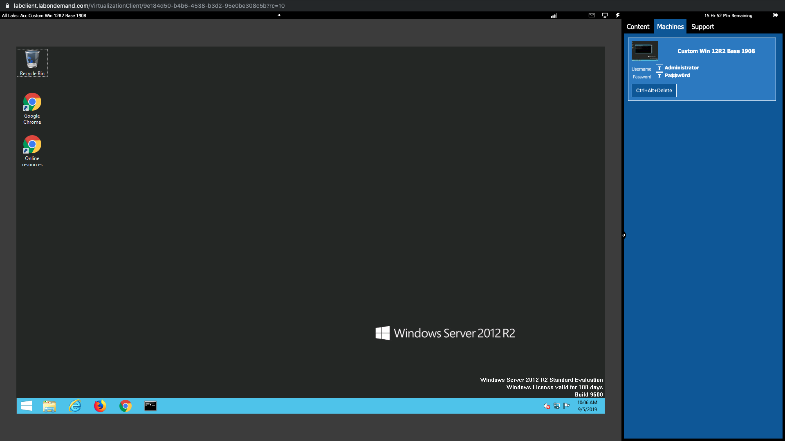
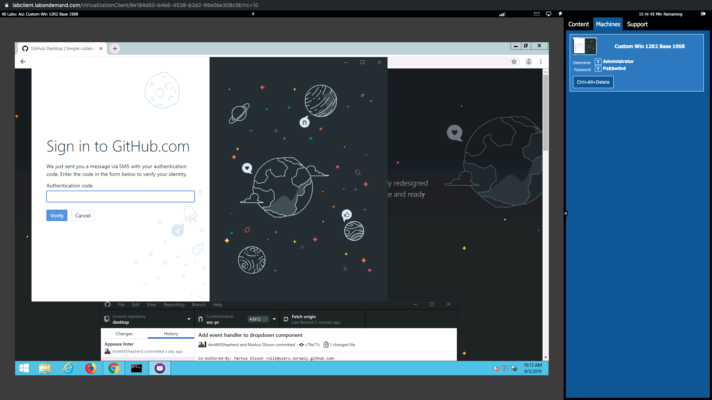
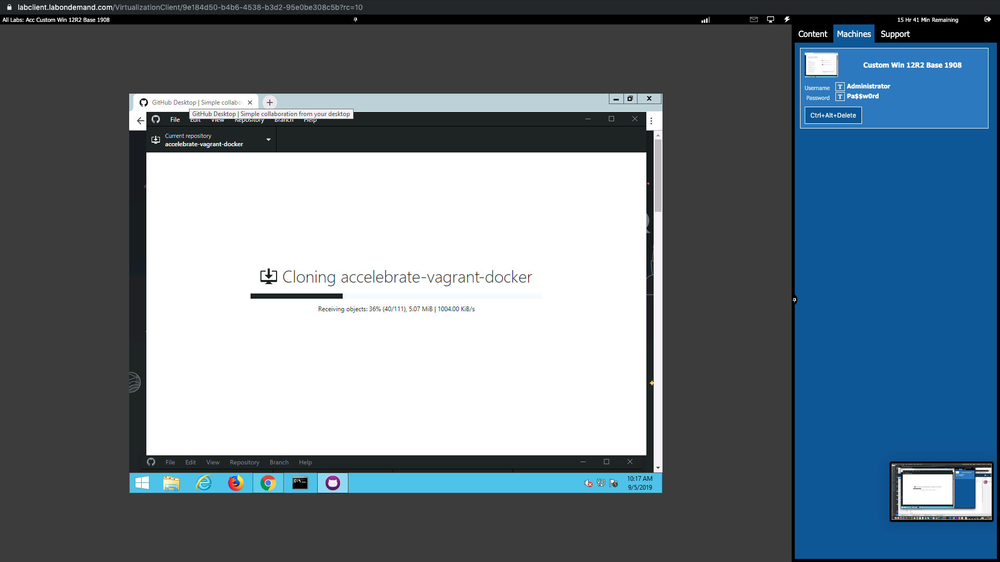
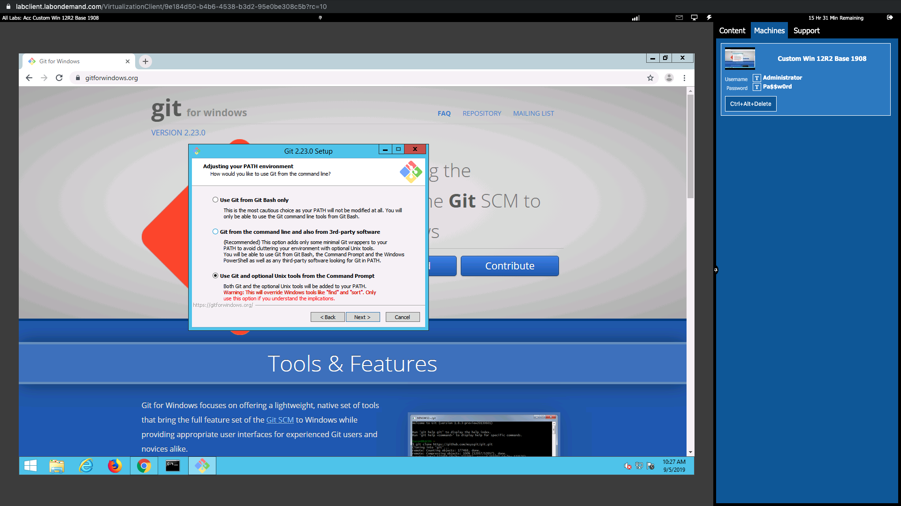
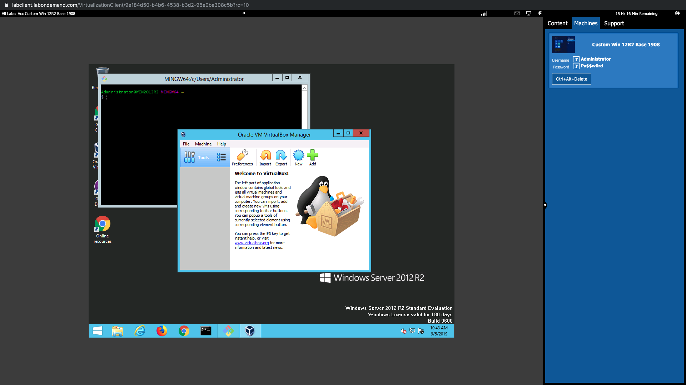
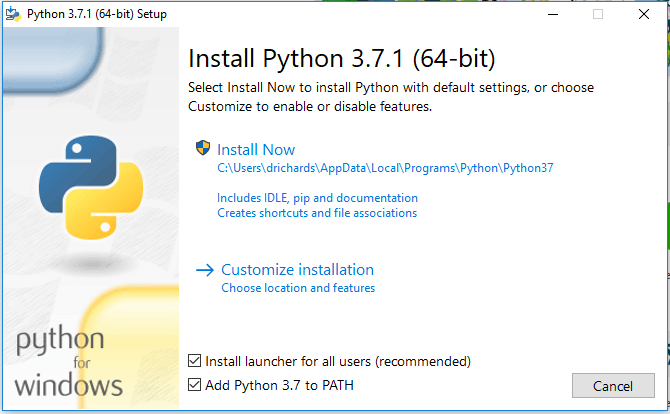
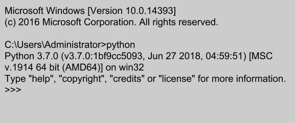
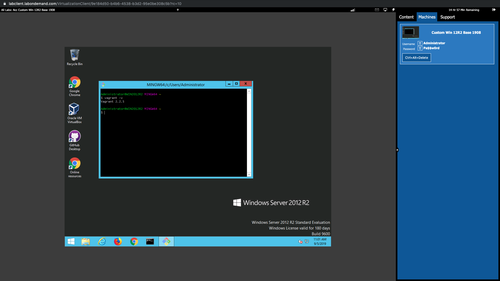

# Prerequisite Setup

## Set up the Virtual Lab

1. Using the link provided by accelebrate- start up and log into your windows image. 

2. Congratulations! You've got a virtual machine! Let's start setting up virtual machines on your virtual machines!!

## Download and set up GIT 

1. Let's get Github for windows [here](https://desktop.github.com)- or...because we don't have it yet- it's **https://desktop.github.com**

2. Once it's downloaded go ahead and sign into your github account 

3. Now that you are signed into github we want to **clone a repository from the internet**. That should bring up another window. Do a search for **ferninphilly/accelebrate-vagrant-docker**. You can leave all of the options as the default. Click "OKAY" to clone it.

4. Now open up your file directories and navigate to the directory **C:\Users\Administrator\Documents\Github\accelebrate-vagrant-docker**. If you see the **accelebrate-vagrant-docker** directory then congrats!! You've got GITHUB!!

## Download and set up GIT BASH

1. Now that we have this code base inside our directories we can (hopefully) start using links! Let's get git bash by going [here](https://gitforwindows.org) (or we can use https://gitforwindows.org).

2. Download that one and double click it. When it opens up the installation windows there **are** two changes we need to make:

    * "Use Git from the Windows Command Prompt" with this option you will be able to use Git from both Git Bash and the Windows Command Prompt.
    * "Checkout as-is, commit Unix-style line endings"

3. Everything else can be default (if you mess up- don't worry...just re-install). Once you're done with that go ahead and click on "Launch Git bash" at the end (if you haven't launched then you can search from Windows and do it from there). 

4. Launch a git bash window. Congrats! Third step done!

## Download and set up VirtualBox

1. Now onto VirtualBox- which is one of the **providers** (we'll be getting to that later) we'll be using for our Vagrant machine. Head [here](https://www.virtualbox.org/wiki/Downloads) (that's https://www.virtualbox.org/wiki/Downloads) and download the windows virtualbox executable.

2. Double click on the exe and run through all of the defaults (it's fine) including installing the network drive.

3. Do a quick search and launch virtualbox (just to make sure it worked!). Screen should look like this:

## Download and setup Vagrant

1. Head [here](https://www.vagrantup.com/downloads.html)- which is https://www.vagrantup.com/downloads) and choose the appropriate 64 but system version. 

2. Download the MSI and install. All defaults again is fine (you have to accept the agreement)

3. Grab a cup of coffee and settle in...this could be a while...but once it's done go ahead and restart (you should be presented with the option).

4. NOW- once your VM has restarted go ahead and open up a **git bash** terminal (you can do a search for them and open up). Once that's open type in `vagrant -v`. If you got a response...congratulations!! We're good to go!!

## Download and install Python and PIP

1. So- as a prerequisite to using Ansible we need to have Python installed on our host Operating System (this is also a generally useful thing to have as python is a great programming language).

2. So navigate [here](https://www.python.org/downloads) (https://www.python.org/downloads) and download python version 3.7.

3. During the download please make sure that you add **Python3** to your PATH variable so that it's usable from powershell (watch that bottom check mark!)

4. Open up a powershell window and type in the word `python`... if you get a python shell like the one below- excellent work! **If you get an error message:**
    
    * Go to your downloads and click on the `python.exe` again
    * Choose "modify"
    * Add to environment variables and add to path

5. Now go back to your powershell by typing `exit()` from the python prompt.

6. Once you're back on your windows powershell prompt type the following in: `pip -V`. If you get version information- congratulations! You've got python and PIP!

7. FINAL note- **upgrade pip** with `pip install --upgrade pip`

## Download and install Ansible

1. As one of the most powerful aspects of Vagrant is it's ability to **provision** we're going to be going over some best practices around using third-party provisioners with Vagrant.

2. While there are several provisioners in the market that work well with Vagrant (and they are all in constant competition for market leadership) I've found that the best and "easiest-to-use" on the market at the moment is **Ansible**

