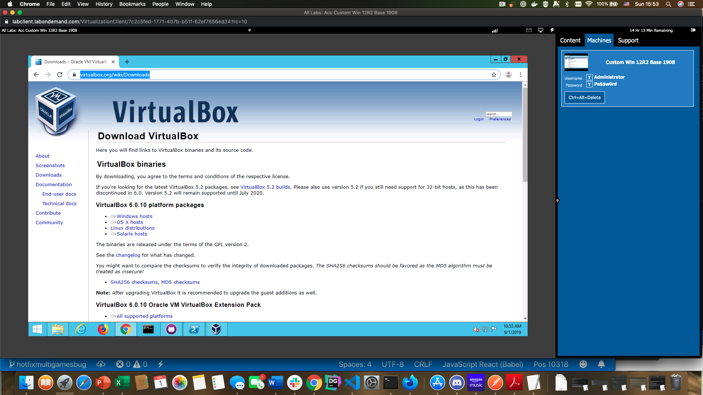

# Installing vagrant

## Download and setup Vagrant

### For Windows

1. Head [here](https://www.vagrantup.com/downloads.html) and choose the appropriate system version (64 bit). Download the MSI and install.

2. Now open up a powershell terminal and type in `vagrant -v`. If you get a version number then you've successfully installed vagrant on your system.

3. We still need one more thing to get Vagrant running successfully on our OS- a [virtualbox](https://www.virtualbox.org/wiki/Downloads) system that we will use as a sample provider for our local virtual machines. In order to get this installed go to the link here and download the windows version and install it.

4. When installing the virtualbox simply click through the defaults (allow it to install in the default directory, in other words...just click through all default settings). Allow it to **finish**. 

#### Install github on Windows:

1. First head [here](http://desktop.github.com) and download the 64 bit native github desktop manager. 

2. Once the app is downloaded and opened please sign in to git with your credentials on the desktop app (if you need to sign up for an account you can go [here](http://github.com/join) and sign up. DEFINITELY worth having a github account!)

3. Once you are signed in we want to clone [this](https://github.com/ferninphilly/accelebrate-vagrant-docker.git) repository. You can just leave it in the **/Users/Administrator/documents/Github** directory.

4. Open up a powershell window and **change directories** into the appropriate directory with this command: `cd \Users\Administrator\Documents\Github\accelebrate-vagrant-docker\module01\lab`

#### Install Docker on Windows

1. To download Docker on your local machine go [here](https://www.docker.com/get-started)
Once it is installed you should see a docker image in your "running apps" bar (on mac and windows they are different).

2. Go to your command line (powershell) and type in `docker info`. If you get a return value then congratulations! You have docker installed on windows!

### For Mac

1. For Mac I usually find it easiest to use [homebrew](https://brew.sh/) to manage my packages. If you don't already have homebrew go to the link and download it. 

2. Once you have homebrew installed simply do a `brew cask install vagrant` and once that is done run `brew cask install virtualbox` and then finally `brew cask install vagrant-manager`

3. Check to make sure that vagrant is installed by opening up the command line (for Windows or Mac) and type in `vagrant -v`. If you get a version number there then you have successfully installed vagrant on your system. IF NOT please see me. 

4. **Do this step only if you run into issues:** 
Now occasionally you might have a second hypervisor in use which will block vagrant. If you are on mac run `lsmod | grep kvm`. This will give you a list of kvm hypervisors running. Let's say your hypervisor is `kvm intel`....then `echo 'blacklist kvm-intel' >> /etc/modprobe.d/blacklist.conf` to blacklist that hypervisor. 

## Download and setup Docker on Mac

1. For mac we can manage with homebrew; simply go with `brew install docker docker-compose docker-machine` and we are good to go on mac.

2. Open up a command line editor and type in `docker info`. If you get a bunch of stuff- congrats! You've got DOCKER! If not please see me. 

