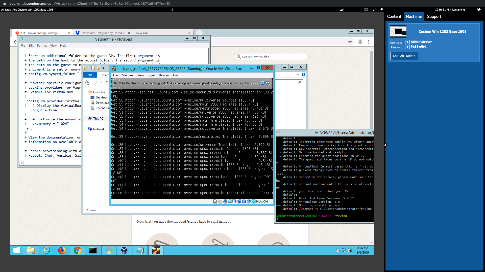

# Lab One: Setting up the provisioners and providers

## Setting up your vagrant environment

1. So as we discussed in the presentation- the important thing to remember about vagrant is that it is **not a virtual machine**. It is an abstraction layer that allows us to **run** virtual machines.

2. This class focuses primarily on using **docker** as the provider...but it's also useful to look at other providers such as **virtualbox** and **vmware** as possibilities. VIRTUALBOX is the primary provider for vagrant.

3. Let's explore **Virtualbox** really quickly before we start! Let's open up Virtualbox and take a look at the interface here. You should see a Penguin there:

4. Now- right now you'll notice that there are ZERO virtual machines created. Go over and click on the blue "NEW" gear icon at the top. You'll notice immediately that it wants you to point to a file (*.ovf or *.iso) and that it expects you to have it downloaded locally in order to do this. So where do we get this file from?

5. Okay- so if we want virtualbox images to run we would normally go online to somewhere like [here](https://www.osboxes.org/virtualbox-images/) and download the image we want. You'll notice (if you take a look at some of them) that they are usually around 1-3 GB...and generally pretty vanilla (i.e: very few, if any programs, pre-installed)

6. So the process would be something like this: 
    
    * Get Virtualbox (done)
    * Go to your osboxes site and download the image you want
    * Put the large image into a directory where you can access it
    * Open up virtualbox, choose "NEW" and point to that folder.
    * Start the virtual machine from the virtualbox app
    * Click on the virtualbox screen and start using the virtual machine

## Vagrant Commands    

1. Let's start by going over our main vagrant commands: Open up a **git bash** window. Run a `pwd` you should see that you are in **C:\Users\Administrator** by default. Go into your bright, shiny new github repo with the command `cd Documents\Github\accelebrate-vagrant-docker\module01\lab`. Run an `ls` and you should see only the **app** directory.

2. Once in here we're going to run our first key vagrant command: `vagrant init`. This should result in a file appearing that says **Vagrantfile** in that directory. 

3. Let's take a quick look at the **Vagrantfile**: Essentially when you open it you'll see a lot of the explanation as to what should happen here commented out...but it should give you an idea of what's going on with Vagrant!

4. So the first uncommented section is `Vagrant.configure("2") do |config|`- which starts a code block which is basically saying "DO A THING" (the "2" has to do with versioning).

5. `config.vm.box = "base"` is the next uncommented section. Let's take a quick look at this! Essentially what's happening here is that we are naming the type of virtual machine we want to create. With a default `vagrant init` we will get a box called `base` with a very, well..."BASE" operating system installed.

6.  Obviously this is not as useful as it __could__ be... this is just a very basic image. NORMALLY we would want a virtual machine that actually has some sort of OS- maybe **ubuntu** or **CentOS**? So before we go on let's change the `vm.box` to have an actualy, __operating system__ on it! 

7. First let's delete the current Vagrant file (on linux simply do `rm Vagrantfile` from the command line). Now instead let's get a new box- `vagrant init hashicorp/precise32`. This should make a new `Vagrantfile` appear. Go in and take a look at the Vagrantfile. What does the **vm.box** have on it now? 

8. NOTE that if you don't want to bother deleting the **Vagrantfile** you can do `vagrant init -f hashicorp/precise32` which forces an overwrite of the current vagrantfile in the directory.

11. Now let's go into our **Vagrantfile** and you should now have a `config.vm.box = "hashicorp/precise32"` which is a way of creating a ubuntu virtual machine. 

12. While in the Vagrantfile also uncomment the following lines:
    * `config.vm.provider "virtualbox" do |vb|`
    * `vb.gui = true`
    * `end`

13. Our next command is to actually bring it to life! From the same directory run this command: `vagrant up`. You should see the image (thing ISO image) being downloaded. __This will take a while__ so if you want a cup of coffee...now is the time to grab one.

14. Once downloaded you should get a pop-up that IS your virual machine. It might be asking for a password there. The username/password by default is `vagrant/vagrant`. On Git bash you should see a message like this one:

...and ultimately, when the VM is made, you should see a message like this one:

15. Go ahead and play around in the virtual machine for a while (maybe run a `sudo apt-get update && sudo apt-get upgrade` for example...or download whatever you want there)

16. By now you've probably noticed what a complete PITA (not going to define that acronym but you can figure it out I'm sure!) it is having to click IN and OUT of this vm. __REALLY__ annoying, isn't it? Like- once you're in it's not so bad but having to click in and out gets old....fast! __SO...what can we do to make this process easier?__

17. Go back to your **git bash** terminal (assuming it's still open). Go into the directory with your vagrantfile. On the terminal type in `vagrant ssh`. After a couple of minutes you should see a command line that matches the output from the virtual machine screen!

18. NOW- IF YOU WANT...we can get rid of the (kind of annoying) terminal. 

19. START by clicking on the red "X" on the top right hand corner of your Virtual Machine and just choosing to "save the machine state". This will close the virtual machine visual output.

20. Now let's go BACK into your vagrant file and re-comment these three lines:

    * `config.vm.provider "virtualbox" do |vb|`
    * `vb.gui = true`
    * `end`

21. Doing the above will basically make it so that `vagrant ssh` from the git bash command line is the only (and preferred) access to the virtual machine. This will keep it easier as you don't have to deal with multiple screens.

19. NOW we need to find a way to re-build this box...which is what we'll go over in the next section.

### A couple of quick notes! 

1. Note the default port forwarding! Port 22, in the vast, vast majority of networks, is reserved for ssh access to a machine (we can edit that later in the Vagrantfile). This means that access to our virtualmachine will be through port 22- which means ssh access. Vagrant has also done us the favor of copying the ssh key into the `authorized_keys` doc in the `~/.ssh` folder!

2. Now let's head over to **virtualbox** and take a look at our bright, shiny new virtual machine.

3. If you want you can right click on the virtual machine in virtual box and choose "view" to get a view of the virtual machine running. This will allow you to go "into" the virtual machine here as well as through ssh.

## Creating the environment

1. First off, while we're in our new Ubuntu machine, we should run a couple of basic checks. Run our basic ubuntu update command (`sudo apt-get update && sudo apt-get upgrade`). We can also add in any packages we want with `sudo apt install...`)

2. Now let's get out of our VM...which is, fortunately, very simple to do. On the command line simply type `exit`

3. Okay- now let's mess around with some other aspects of Vagrant to show how it can be used as a simple environment to develop a small website. If we were going to do this what are some things that we would want to include? Well...if I was in the middle of development I would probably want to be able to mount folders pretty simply. So how can we do this in a straightforward method? 

4. Go into your Vagrantfile and find `config.vm.synced_folder`. This is the folder that will be mounted onto your ubuntu machine when you start it up. Now...I have code for a very basic website here in the folder known as "app". In this example we're going to deploy the app on our localhost. To start this obviously we need access to the "app" folder from within the machine SO...let's update (and obviously UNcomment) the "synced_folder" as follows: `config.vm.synced_folder "./app/index.html", "/var/www/html/index.html"`.

5. Let's do another `vagrant up && vagrant ssh` and see if everything worked! Once in there do a `pwd` to see what directory you are in (should be **/home/vagrant**) and then do an `ls` to see what files are in there with you. Did it work?

6. Wait...it didn't? If it worked and it was mounted you SHOULD see a new folder in your home directory...but that seems to be missing? Why is that?

7. So basically our machine never stopped RUNNING. If we want the machine to re-read the vagrantfile we need to **reload** it. Run this command: `vagrant reload` and see what happens. You should see a restart on the machine and then a re-provisioning of the virtual machine. Now that you have **reloaded** the machine run a `vagrant ssh` to go into the machine and then an `ls` to see what's in there. Did your website make it in there this time?

## Vagrant Boxes

1. So- this is a nice beginning and hopefully now you can see where Vagrant is __incredibly__ useful for bringing up virtual machines!  One of the bigges differences between Vagrant and Docker is obviously that Vagrant is intended to be a more permanent solution. Unless you ran `vagrant halt` or `vagrant destroy` the machine is probably still running in the background.

2. To review- these are the commands that we have used thus far and probably the most common ones you'll be using:

`vagrant init`: Creates the Vagrantfile in a directory
`vagrant up`: Basically takes whatever is in the Vagrantfile and builds a machine from it.
`vagrant ssh`: Go into our vm via ssh
`vagrant reload`: It's the equivalent of running `vagrant halt && vagrant up` and will reload and re-provision the vagrant machine. Basically- this is what you'll need to run if you make changes to the Vagrantfile.
`vagrant reload --provision`: Forces a complete re-provisioning of the machine
`vagrant stop`: Stop your vagrant machine
`vagrant suspend`: Suspends your virtual machine and remembers the current state
`vagrant resume`: Resumes your stopped vagrant machine
`vagrant destroy`: Destroys your vagrant machine (so it will need to be re-provisioned)

3. So let's talk about how to get different kinds of machines! In the example above we set up a straight UBUNTU machine and apache server...but __what if__ we wanted a different **type** of machine? Well- fortunately there is a repository for that!

4. Click [here](https://app.vagrantup.com/boxes/search) for a quick look at the main Vagrant Repo of different offerings of images from which to build virtual machines. Using these is as simple as adding a line to your vagrant file OR (as we shall see) pulling them directly from the repository with `vagrant box add`

5. So these are __images__ of machines that Vagrant can run! Some of them come with a lot more than just straight Operating Systems. As you can see you can get all sorts of different machines here...a lot of them pre-loaded with some pretty cool stuff (like Docker images in the Dockerhub repo, right?). We went over images in the powerpoint of course. 

6. So let's do a quick search for a **CENTOS** box by typing **hashicorp, centos** into the search bar and see what comes up...

7. Let's say that we wanted to **download** this one but didn't want to **keep** it. You see-- what happens with a Vagrantfile is a lot like what happens with docker- to whit: When we say "I would like a docker image of Django" or "I would like a vagrant image of Django" the first thing that happens is that docker and vagrant check **locally** to see if they can find the image locally. __If they cannot__ find the image locally then they will hit the vagrant repo here and download it. Sometimes this downloading takes time...

8. To avoid spending a lot of time waiting for downloads it might behoove us to go and **get** these boxes and store them locally. To that end we can simply run this command: `vagrant box add hashicorp-vagrant/centos-7.4` and wait. This will download that box for us. Let's do that now...

11. Once the download has completed (and it might take a while) you can see what images you have locally with `vagrant box list`

12. Now go into your new Vagrant box and have a look around with `vagrant ssh`

13. Great work!! NOW- there is only one step left in this project and that is to utilize one of the most useful commands to get rid of everything and start over (which is common among developers- the "let's just nuke it and start over" activity!): `vagrant destroy`

14. Once you have destroyed your currently running virtual machine you should have a clean slate. To completely wipe out everything (the "Nuke it" option) all we have to do is delete the **Vagrantfile** and the **.vagrant** directory and then we can re-initialize the entire directory. So let's do that now:
`rm Vagrantfile && rm -rf .vagrant`

15. You should now have a completely clean system. Congratulations on making it through the first lab!!

## Confused?? ASK QUESTIONS!

