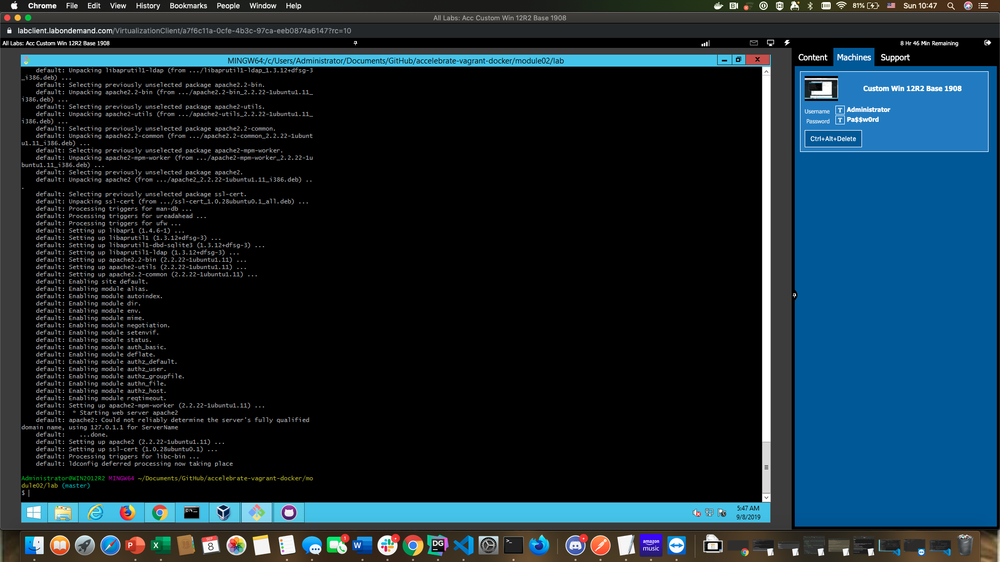
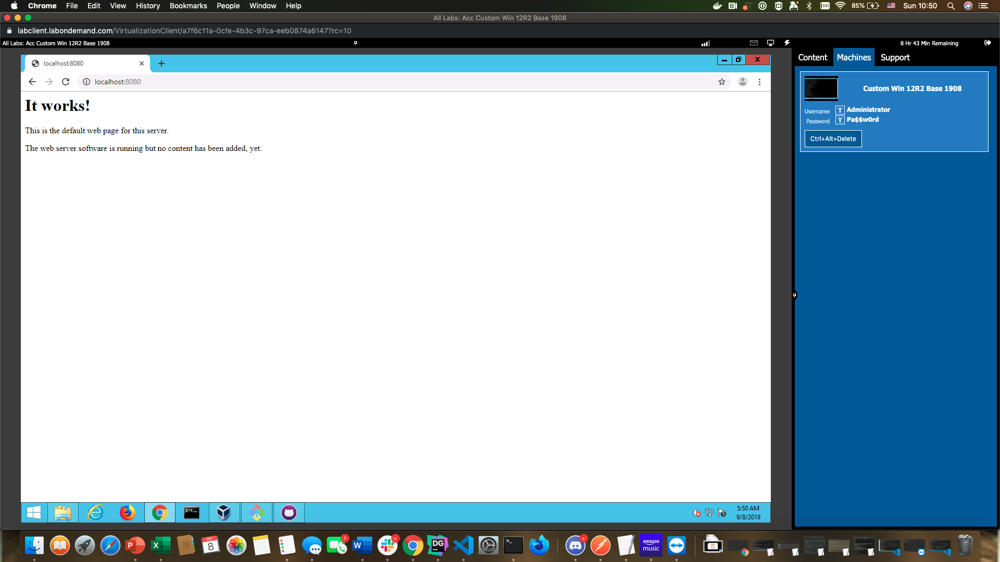

# Lab Two: Provisioners

## Creating our first development environment

1. So now that we've been over the basics of Vagrant let's go ahead and create an application that demonstrates how we might use it in real life. Let's put up a quick single-page website! 

2. Before we start let's plan out what we need to do...SO- in order to save time let's just use one of the boxes that we already have (specifically the **hashicorp/precise32** box- which is to say....ubuntu). So for a checklist:

* **Environment:** ubuntu 32 bit
* **Web server:** apache2
* **Port:** 80 on the host
* **Host:** localhost

3. So for the environment- check...all set (We can check to make sure that the virtual machine is there by doing a `vagrant box list`...go ahead and do that now and you should see the **hashicorp/precise32** box there). 

### Provisioning from the shell

1. NOW- we need to make sure that our virtual machine adds the program that we need. Specifically- we'll need an **apache2** program installed with our virtual machine. NOW- you __might__ be thinking "okay- so I'll just create the VM and add apache2 with `apt-get install -y apache2` manually and then save the machine!"


2. REMEMBER- we are looking to create a server that can be __re-created__ by other developers (the **repeatable** aspect of ideal development environments from module one). This means that we need all of the code in one central location (let's call it something like a....**Vagrantfile**(?)). SO- we want apache listed as a dependency. Where do we do this? 

3. Go into your **git bash** console and `cd ~/Documents/Github/accelebrate-vagrant-docker/module02/lab`. 

4. Now we need to **initialize** a vagrant repository here....any idea how to do that? (hint: it's `vagrant init hashicorp/precise32`). This will, of course, create a **Vagrantfile** in your local repository.

5. Using **Notepad**- go ahead and open up the Vagrantfile. NOW- we want to put in an apache server, right? SO let's navigate down to the bottom of the file. What we're looking for is the section that looks like `config.vm.provision "shell"`. THIS is basically what happens when we **provision** (read- **create**) the server. Basically what Vagrant will do is create the machine and then run any code written here.

6. So considering that...let's write in some quick code that can take care of adding our apache server any time someone brings our virtual machine up. Replace the commented `config.vm.provision` section with:

```shell
    config.vm.provision "shell", inline: <<-SHELL
        apt-get update
        apt-get install -y apache2
    SHELL
```

7. Obviously we're running straight shell commands here which makes it easy to see what we're doing (pretty straightforward- we're installing a web server!). BUT- before we run this we should do something that we should SEE (while it's NICE to have a webserver and all- it's BETTER if we can SEE something coming from the webserver!)

### Mounting directories

1. SO- we have a handy piece of code here in our **app** folder in the **module02/lab** directory. It's a __very__ basic html webpage but we need to imagine that it could be a complicated, intricate, well tested application instead, right? SO...for example...if we had a **Django** application on our host we would want to be able to see it in our virtual machine as well.... so how do we do that? 

2. Open up your Vagrantfile and head over to the line that reads `config.vm.synced_folder "../data", "/vagrant_data"`. This is your main option for your __mounted directory__- in other words the gateway between your host and virtual machine. Basically this **config.vm.synced_folder** makes the directory on your host machine accessible inside the virtual machine. 

3. Considering that...let's change that line to look at our APP directory and move it to the **local home directory** (i.e: the directory you are in as soon as you enter the vm. If you want to see this go into the virtual machine with `vagrant ssh` and type in `pwd`...you will get **/home/vagrant**)

4. SO...armed with THAT knowledge let's mount the **./app** directory directly onto our **home** directory by altering the config line in the vagrantfile to read `config.vm.synced_folder "./app", "/home/vagrant"`

5. Now- you can do this once with a single directory on your host machine or frequently with **multiple directories** (if you'd prefer) by just repeating that code for several lines. Something like:

```
config.vm.synced_folder "./app", "/home/vagrant"
config.vm.synced_folder "./anotherpartoftheapp", "/home/wherewewantit"
config.vm.synced_folder "./configfiles", "/home/configfiles"
```

6. The utility of something like this should be obvious- we are now able to effectively allow our developers to develop the __code__ portion of the application __locally__ and then run it in a __dev__ environment that they can create on their own machines by mounting their code base onto the virtual machine. 

7. Another advantage of mounted directories- **they are mounted**...so changes happen __in real time__ which is a HUGE plus when we're talking about coding (it means that every time we make a change to the code on the HOST machine we don't need to restart the vagrant machine...we'll get into **rsync** and **nfs** later but **rsync** should be turned on by default)

### Port Forwarding

1. Now we need to make sure that we can SEE the results of our hard work! BECAUSE we want to be able to see what our awesome website will look like in our browser we want to forward the port from our virtual machine (obviously virtual machines don't have nice, visual web browsers like CHROME so it would be a pain to try to see what your website looks like)...so this means that we will need the virtual machine to "take over" the web port of the HOST machine! 

* In order to do that let's go down to the **config.vm.network** section. You'll notice that there is are three entries here for **config.vm.network**- one to create an internal network one to create a private network, and one to allow public access.
* As we do not want public access (we're just developing here) let's uncomment the **second** `config.vm.network` entry (the one that does not allow public access and creates a network): `config.vm.network "forwarded_port", guest: 80, host: 8080, host_ip: "127.0.0.1"`
* This is basically telling vagrant to forward all requests on the **host machine** (windows) PORT 8080 to the VAGRANT machine's PORT 80.

2. The next thing we need to do is to make sure that, when we create our website, we can do effective **port forwarding**. As we know- the default http port on servers is port **80** (or port **443** for secure socket layers).

3. Let's go back into our **Vagrantfile** and update the file (around line 26) to the following (you probably only have to uncomment it): 
`config.vm.network "forwarded_port", guest: 80, host: 8080`

4. Now- 80 isn't the __only__ port we can forward on to (obviously). For a MYSQL virtual machine you can do 3306, for a node app you can forward on to 3000, etc... basically this will allow you to access the virtual machine port THROUGH your host port.

5. This means that from our host machine we'll need to append the ":8080" to the end of any URLs that we visit (when looking at URLs we can switch the URL port by appending :portnumber to the end of the url).

### Bringing it all together

1. POP QUIZ: Who remembers how to __reload__ our vagrant machine so that it re-initializes from the **Vagrantfile** instead of just restarting from it's previous state???

2. Run the previous command now. Notice anything happening? Something like....installing the apache2 server where it belongs? Awesome, right? 



3. Once the vagrant machine has finished re-provisioning let's see if everything worked! **On your host machine** head over to the browser (chrome) and go to http://localhost:8080 (why? Because if you recall we forwarded port **80** on the vagrant machine to port **8080** on the host machine!)



4. NOW- let's go into our vagrant machine and check if everything is where it belongs. Run the (POP QUIZ) command to go into your vagrant machine and run a quick `ls` in there. Do you see the contents of the **app** folder in there? (meaning that the **mounted folder** section worked?)

5. That's great! SO- we know that the files from the host directory are successfully making it into our vagrant machine BUT...we're not seeing the index.html BECAUSE....the apache server isn't looking in the **/home/vagrant** directory for what file to present....it's looking in **/var/www/** which is the **default** directory for the apache2 server! 

6. This means that we need to get the **index.html** file in the **home** directory INTO the **/var/www** directory. There are TWO ways that we can do this:
    * Add a command to copy the file from the **home** directory to the **var/www** directory OR
    * Mount the **index.html** DIRECTLY into the **/var/www/** directory

7. Another POP QUIZ: Change the Vagrantfile to do one of the two things above, reprovision it, run it, and show it on your browser.

8. **Congratulations on creating your first environment!!**


