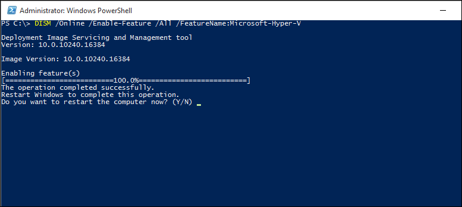

# Lab Three: Provisioners

## Setting up a provisioner


1. Up to this point we've been heavily focused on using the `SHELL` commands to do very simple provisioning onto our Vagrant machines.....and shell works very well....at least until our machines start getting fairly complex. 

2. In the quiz leading up to this section we went over creating a __very, very basic__ Django setup...and you saw how many lines that took up, right? Well imagine if you had to install 100 packages. Or 1,000? As your production machine grows more and more complex the complexity of these machines can grow and, well...we don't want incredibly long, complex, difficule **Vagrantfiles**, right?

3. So just consider that from an organizational perspective it would be a lot easier to keep the Vagrantfile separate from the provisioning code. The **Vagrantfile** could deal with things like the amount of memory, the Operating system, and maybe one or two basic commands while, in a separate section of our Github repos we could keep **provisioning code** in the form of **Ansible Playbooks** (or **Chef Cookbooks** or **Puppet Manifests** or whatever...)

4. The main point here is that these machines, created by Vagrant with just a tiny bit of code, are always the same and always download the same dependencies so that we get a stable environment!

5. In this section of Lab 3 you'll notice that we have a handy-dandy **provision** folder which is an ansible system that I set up for this class. You can explore through the sub-sections if you'd like but the main thing to focus on is **provision/roles/vagrant_test/tasks/main.yml** as this is the folder that will be __doing__ everything for us. 

6. Without going **TOO** deeply into Ansible here (this is a **Vagrant** class after all)- what's happening in that **tasks/main.yml** file is three steps:

    * INSTALLING an apache2 server (see the variable there? `"{{ vagrant_test.package }}"` ? Well look in the `defaults/main.yml` and you'll see the variable that it points to- our old friend **apache2**!)
    * STARTING the service- pretty self explanatory here; start up the webserver and
    * COPYING a new **index.html** file into the root folder for the apache2 web server.

7. SO IN SUMMARY- it's basically the same thing we did __earlier__ BUT...now it's in ANSIBLE and has room to grow!

8. SO- how do we prepare our Vagrantfile for all of this? Well- let's start by updating a few things:

* We'll need a forwarded port (this is a web application after all!). Let's forward to port **80** on the guest machine to **8086** on the host machine.
* We'll need to make sure we're using the right box...let's go with **bento/centos-7.2** (which we already have downloaded so it should save time).

9. Now head down to the **config.vm.provision** section. We're going to want to update that as follows:

```ruby
  config.vm.provision "ansible_local" do |ansible|
    ansible.playbook = "provision/playbook.yml"
    ansible.verbose = true
    ansible.extra_vars = {
      hello_web: {
        package: "httpd",
        service: "httpd",
        docroot: "/var/www/html"
      }
    }
  end
```

10. SO- a couple of quick things to note here: 

* First- you'll notice that we are able to use "ansible_local" as the provisioner and that it's **built in** to Vagrant...which is a HUGE advantage because it saves having to keep these pieces together. 
* Second: You'll notice that I'm overwriting some variables here. You remember how two steps ago I showed you the ansible file that had "apache2" as the **package** variable? WELL...in CENTOS that's known as **httpd**...so we're going to overwrite it directly from the Vagrantfile here.

11. Close out your vagrantfile and let's go with a `vagrant up` and see what happens next! 

12. Ideally (and because we chose "verbose") you should, after boot time, start to see the playbook being played out (meaning that the necessary commands are there). 

13. **CONGRATULATIONS!** You just successfully provisioned a Virtual Machine with a third party provisioner.

14. **FINAL NOTE**: If you don't know **ansible**, **chef**, or **puppet** I can't recommend them enough as a great way to organize your provisioning code. There will come a time when you might need to provision hundreds of servers at once to handle a large volume of data and these tools are __essential__ to keeping your environments healthy. If this is your first exposure to Ansible I'd be happy to walk through the logic of the playbook with you! 

## Creating a network of multiple machines

1. It is entirely possible- in this modern, cloud based era- that your particular production environment is set up in such a way that you are dependent on multiple machines to form a **network** to work.

2. The most common version of this is a single machine running your database (**mysql** or **postgres** or **mongo**...whatever you are using) and another machine running your **application code** (node.js, python, etc). **Django**, for example, depends on a back end server from which to form the objects that are used as models.

3. The good news is that with Vagrant we can emulate a network environment simply by downloading a couple of machines and running them locally! So, in other words- we can hook up box one to box two and increase our computing power through the power of networking. 

4. What we're going to do in this section is create a connection between two disparate boxes (both Centos7 though!) through a private IP network.

6. Now let's `vagrant destroy` our wonderful __ansible created__ box and `rm Vagrantfile && rm -rf .vagrant`

7. Okay- so let's bring up a multi-machine system in vagrant. __Little known trick__...this is easily done with `vagrant init bento/centos-7.2` again in this directory and take a look at our new **Vagrantfile**

8. To keep our code separated out let's use another neat aspect of the language of the **Vagrantfile** (**Ruby** if you are curious)- we are going to separate each machine with a `config.vm.define` block. So let's overwrite the `config.vm.box = bento/centos-7.2` with the following block of code:

```ruby
  config.vm.define "webserver" do |subconfig|
    subconfig.vm.box = "bento/centos-7.2"
    subconfig.vm.hostname = "webserver"
    subconfig.vm.network :private_network, ip: "10.0.0.10"
  end
```

10. So basically, what we have above, is the minimum required entries to define a machine (in this case our webserver). The **hostname** needs to be unique and then the **private ip** needs to be in the **10.x.x.x, 192.168.x.x, 172.16.0.0 - 172.31.255.255** range. In this case, for simplicity, let's keep it in the 10 range and go with "10.0.0.10".

11. NOW, below this we're going to define a second machine in our Vagrantfile that will act as our database:

```ruby
  config.vm.define "mysql" do |subconfig|
    subconfig.vm.box = "bento/centos-7.2"
    subconfig.vm.hostname = "database"
    subconfig.vm.network :private_network, ip: "10.0.0.11"
  end
```

12. Notice that our ip in "10.0.0.11" this time instead of the "10.0.0.10" in the last ones. This gives the second host a unique IP address.

13. Let's close up our Vagrantfile and bring everything up! `vagrant up` now!

14. Did you get an error? No worries- that was expected. As we brought up TWO machines this time we'll need to specify which of those machines we want to ssh into. Let's go into our webserver with `vagrant ssh webserver`

15. Once in let's see if we have our network up! The best indicator here is if we can ping the other machine! So let's `ping 10.0.0.11`. IF you get back pings then congratulations! Your machines are communicating!


16. NOW...I've placed a MYSQL ansible playbook in this module03 lab for you. This Ansible playbook WILL install MYSQL5.7 on any machine you want to point to. I have done this with a nefarious purpose


17. Your mission (if you choose to accept it) is to provision JUST the mysql server with the attached **./mysqlplaybook/playbook.yml**. HINT- use the code from earlier in this lab.

18. THEN...once you have that __but before you ssh into the server__ we'll also want to have a way to check if we're successfully networked together...which means that the webserver will need some way to access mysql.


2. But __what if__ we wanted to build vagrant machines using another provider...like **VMWARE** or **DOCKER**? 


3. So you'll remember from our earlier module that in the vagrant file there is a **config.vm.provider** section that lists whether we want the visual gui from virtualbox or just to allow ssh access to the machine. To remind you- we initially went with `vb.gui = true` 

4. So we're going to switch providers in that section. Let's go with **Docker** in order to bring everything full circle and show how **Vagrant**

5. **Generally**- when choosing Virtual Machine providers- you will want to go with a vm provider that lines up as closely with your host OS as possible. There are a lot of issues that can be avoided if we follow this general rule. In this case **Hyper-V** is the microsoft virtualization provider. BUT (as with most things with windows machines)

6. So let's start by adding in our vagrant box manually BUT..unlike what we've been doing to this point let's explicitly call out the provider. SO...let's run this command: `vagrant box add hashicorp/precise64 --provider hyperv`.

7. Now...this could take a while so let's go through some of the other aspects of hyperv boxes while we wait for everything to download...

8. Another thing to understand about selecting the "provider" is that, because you can have multiple providers for the same box, you need to explicitly call out the provider when you are `vagrant up` -ping the box.

9. SO- before we are able to effectively do this we'll need to `vagrant destroy` the current box in our directory...so run a `vagrant destroy` now.

10. Okay- so if everything is ready to go we should be ready to run everything **except**...


11. Here's the thing....VirtualBox and Hypervisor __can not__ run simultaneously. Without going into the long, painful, technical aspects of setting up virtualization on windows machines- let's just take it as given that we'll need to **turn on** the hypervisor on windows in order for this to work. 

12. BUT...let's ALSO take it as given that when we **turn ON** hypervisor on the windows machine we'll also be **turning OFF** the ability for virtualbox to do it's thing. Sorry- but them's the breaks. 

13. Anyways- to turn on the hypervisor (and this could require a machine restart) open up **powershell** on the windows machine and put the following commands into your powershell window: 

`DISM /Online /Enable-Feature /All /FeatureName:Microsoft-Hyper-V`
`Install-WindowsFeature -Name Hyper-V, RSAT-Hyper-V-Tools`



14. Go ahead and run the restart. Now go back into git bash and 