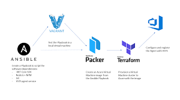

# Lab 04: Creating Vagrant boxes 

1. Up to this point we've been heavily focused on using Vagrant to **pull down** various images from production servers that have __already been created__. In this section we're going to get in to going through  

2. Because, in this hypothetical scenario, we have been keeping our infrastructure-as-code effectively. This means that we have:

* **Vagrant**: is how we are managing our **local** development environment
* **Ansible** (or chef, puppet, or a shell provisioner) is how we are provisioning our server
* **Packer** is the JSON document that we're using to deploy images
* **Terraform** is how we're making the infrastructure



3. Now- let's quickly take a side note here and talk about **machine images**....

4. Let's say you have a Vagrant machine that is running your code successfully. This means that all of the programs are running; dependencies are at their correct versions and the machine memory can handle everything that you are throwing at it. It's basically development Nirvana. 


5. So what's the first thing you would want to do as a developer? (other than pour yourself a well earned celebratory drink!)...probably the virtual version of __take a picture__, right?

6. In other words- the moment after your code successfully compiles and does the thing you want it to do you want to take a **SNAPSHOT** of the server in it's current configuration so that you can always remember that THIS was the mark where it actually worked!! (before another developer comes in and updates/upgrades a bunch of libraries and breaks all of your stuff)


7. SO- with this **snapshot** (continuing with the photograph analogy) you get an **image** of your server FROZEN IN AMBER at this exact moment in time. That **image** is a perfect representation of your machine at this time and can form the basis for a new Vagrant box.

8. The way we take this image is with the `vagrant snapshot` command. This is a way to **store in amber** the state of the machine at this exact moment....so that whatever else you do to the machine (add in new programs, updates, or upgrades) you can always revert back to the image that you created when you knew all of your stuff was working

9. Let's play around with this by using a provisioned machine that we have already created

### Snapshotting an image

1. Before we do anything else let's create a quick LAMP machine using ansible...

2. `cd module04/labs` to go into the module04 directory.

3. From in there run a `vagrant init bento/centos-7.2` to create a basic centos box

4. Now that we have our Vagrantfile (and we all know how to do this already!) let's quickly create an ntp machine here with the ansible provisioner I've supplied here!

5. Go to the **provisioner** section of your **Vagrantfile** and add in this section:

```ruby
config.vm.provision "ansible_local" do |ansible|
    ansible.playbook="provisioner/site.yml"
  end
```

6. Let's also give this machine a name...which is something we haven't been doing much so far. Let's also add this line in under the "provider" section:

```ruby
config.vm.provider "virtualbox" do |v|
    v.name = "ntp_machine"
  end
```

7. This is how we can "name" machines which is just a lot prettier than **default_blahblahblah**

8. NOW...we have this machine ready to go; let's go ahead and `vagrant up --provision` from within the directory and let ansible do its thing and set up ntp for us.

9. 

2. This server was (fortunately) built for you using a separate and very powerful Hashicorp program known as [packer](https://www.packer.io/). We've gone over the concepts of packer in the lecture portion of this lab so you should, at this point, have a pretty good idea of what it is and what it does...

3. So now we have an AMI
